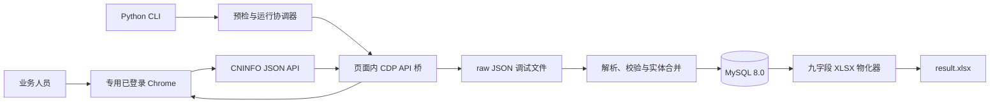
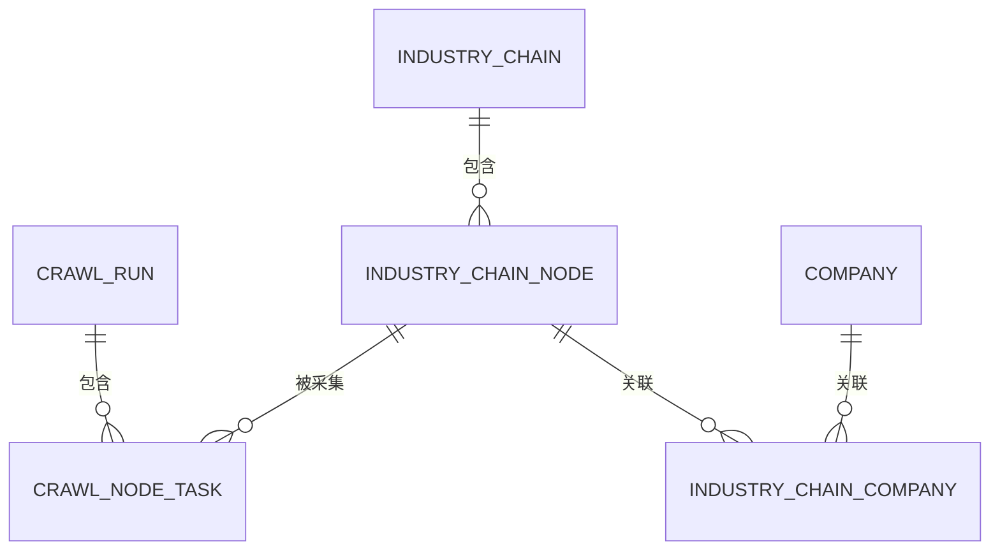

# CNINFO 全主题产业链采集技术设计

日期：2026-09-04  
状态：首期实现规格

## 1. 结论

首期建设一个 Windows 单机 Python 批处理程序。业务人员使用专用 Chrome 配置目录登录 CNINFO，程序通过仅监听本机的 Chrome DevTools Protocol（CDP）连接浏览器，在页面上下文中调用 CNINFO 接口。结构化事实和运行状态写入 MySQL 8.0，接口响应按运行目录保存为调试用 JSON；节点完成后原子提交数据库，每个主题完成后原子重建九字段 XLSX，并支持随时执行 `--export-now`。

首期只包含以下组件：

1. Chrome 会话预检与页面内 API 桥接；
2. 主题、节点和企业采集器；
3. 结构规范化、企业实体合并和校验；
4. MySQL 持久化与断点恢复；
5. raw JSON 故障排查留存；
6. 九字段 XLSX 导出。

不建设服务端、消息队列、多用户后台、浏览器扩展或调度平台。

## 2. 设计依据

本设计以以下文件为业务和接口依据：

- [CNINFO 全主题产业链采集业务需求](../../industry-chain-business-requirements.md)
- [CNINFO 网站爬取实现参考](../../cninfo-crawl-implementation-reference.md)
- [接口报告](../../../api_report.md)
- [采集清单](../../../data/raw/capture_manifest.json)、[根目录响应](../../../data/raw/chainlist_ROOT.json)、[新能源动态树](../../../data/raw/chain_lsx019_dynamicChainMapNew.json)和[新能源节点元数据](../../../data/raw/chain_lsx019_industry_info.json)
- EVA 节点的[节点元数据](../../../data/raw/node_A02n019_industry_info.json)、[年报产品](../../../data/raw/node_A02n019_companyIncome.json)、[上市企业](../../../data/raw/node_A02n019_searchOtherListed.json)，以及非上市企业[第 1 页](../../../data/raw/node_A02n019_searchglobalNew.json)、[第 2 页](../../../data/raw/node_A02n019_searchglobalNew_page2.json)、[第 3 页](../../../data/raw/node_A02n019_searchglobalNew_page3.json)、[第 4 页](../../../data/raw/node_A02n019_searchglobalNew_page4.json)和[第 5 页](../../../data/raw/node_A02n019_searchglobalNew_page5.json)

真实样本的关键基线如下：

| 检查项 | 结果 |
| --- | ---: |
| 目录分类 | 17 |
| 主题 | 134，`chain_id` 无重复 |
| 新能源动态树节点 | 124 |
| 新能源元数据节点 | 124，与动态树 ID、名称一致 |
| 无 `industry_code` 节点 | 14 |
| EVA 年报产品记录 | 声明 9，实际 9 个有效企业 |
| EVA 上市检索 | 7，1 页 |
| EVA 非上市检索 | 71，5 页，行数为 15/15/15/15/11 |

2026-09-04 的登录态 Chrome 轻量检查确认：主题中心会调用 `chainlist/list`；EVA 节点页会调用 `industry-info`、`companyIncome`、`searchOtherListed` 和 `searchglobalNew`；切换到非上市企业第 2 页后再次调用 `searchglobalNew`，并渲染第 16 至 30 条记录。该检查证明登录会话内抓取和分页闭环可行，不替代正式程序对外部 CDP 端口的上线预检。

### 2.1 真实响应对实现参考的修正

生产解析器必须服从真实响应结构，不能只照搬文档片段：

- `companyIncome` 的企业数组位于 `data.list.list`；`data.list` 本身是分页对象。
- `data.company_info_for_industry_dto` 是“总计”对象，不是企业。
- 年报记录需要从 `company_name_one`、`company_name_two` 中取第一个非空名称；EVA 第 9 条记录只有 `company_name_two`。
- 企业不能只保留一个“首选代码”。不同接口可能提供 `stockCode`、`seccode_one/two`、`stock[].stock_id` 以及 `company_id`/`company_num_id_one/two`，这些稳定标识都要参与节点内和跨节点合并。
- 响应中的 `isListed` 与页面分组可能不一致。首期按来源接口分组计算上市状态；原始 `isListed` 仅随调试用 raw JSON 保留，不单独入库。

按全部稳定标识合并提供的 EVA 样本时，87 条原始候选记录对应 85 个企业实体：天洋新材通过股票代码 `603330` 合并，苏州优乐赛通过 CNINFO `company_id=6830078` 合并。后者同时出现在上市和非上市接口，应标记上市状态冲突，而不是生成两个企业。

## 3. 目标与边界

### 3.1 目标

- 动态发现 CNINFO 当前返回的全部主题，不硬编码 134。
- 按 `dynamicChainMapNew.children` 还原每个主题的完整节点树。
- 保留父节点、无企业节点和无行业编码节点。
- 对有行业编码的节点完整采集三类企业接口结果并按 `total` 分页。
- 保存 CNINFO 返回的节点定义文本，供后续与公司内部主题做语义匹配；首期不生成向量或自动匹配结果。
- 中断后从未提交节点继续，不重复已提交节点。
- 重复运行不产生重复节点、企业或节点—企业关系。

### 3.2 非目标

- 不使用截图、OCR 或 LLM 建树。
- 不从推荐上下游无限扩展节点。
- 不补全 CNINFO 未返回的企业、工商全称或供销关系。
- 不采集产业资讯、政策、热点趋势和产业营收；只为以后关联保留键。
- 不自动输入账号、密码、验证码，不持久化 Cookie、token、sign 或请求头。
- 不在首期提供无人值守定时运行。

## 4. 总体架构



采用“单采集进程、顺序请求”的最小模型。首期不并发抓多个节点，避免登录态、限流和节点原子提交变复杂。只有 raw 文件落盘完成且该节点全部接口校验通过后，才在一个 MySQL 事务中提交该节点。

### 4.1 方案取舍

选用页面内 CDP API 桥，而不是以下方式：

- 不把 Cookie 或认证头复制到 Python `requests`，因为这会扩大敏感信息暴露面。
- 不把逐节点 UI 点击作为主采集方式，因为全主题运行速度慢且易受页面布局变化影响。
- 不使用浏览器扩展，因为首期已有 CDP 路径且扩展会增加安装和升级成本。

UI 导航和网络观察只用于建立页面内请求模板、登录恢复和抽样对照；批量数据请求由页面内 API 桥执行。

## 5. Chrome 与安全边界

### 5.1 专用配置目录

业务人员通过项目提供的启动脚本打开专用 Chrome：

```powershell
chrome.exe `
  --remote-debugging-address=127.0.0.1 `
  --remote-debugging-port=9222 `
  --user-data-dir="$env:LOCALAPPDATA\CNINFOChainCollector\ChromeProfile" `
  "https://pis.cninfo.com.cn/ics/index.html#/chainCenter?all_menu"
```

Chrome 136 起，远程调试开关不能用于默认数据目录，必须同时指定非默认 `--user-data-dir`；参见 [Chrome 官方说明](https://developer.chrome.com/blog/remote-debugging-port?hl=zh-cn)。专用目录由业务人员首次手动登录，此后仍由业务人员维护登录态。调试地址必须是 `127.0.0.1`，预检发现非回环监听时拒绝运行。

### 5.2 页面内桥接

程序通过 CDP 在 CNINFO 页面中安装一个仅存于当前页面生命周期的桥接函数：

1. 页面正常加载时，桥接器观察 CNINFO 自己发出的同源 XHR/Fetch，并把必要认证头保存在页面内闭包中。
2. Python 只向桥接函数传入端点名和业务参数。
3. 桥接函数在页面内发起同源请求，只把响应状态和 JSON 响应体返回 Python。
4. 认证头值不得通过 CDP 返回 Python，不得出现在异常文本、日志、raw、MySQL 或 XLSX 中。

如果页面请求头生成规则变化，导致根目录健康检查不能成功回放，运行状态转为 `PAUSED_AUTH`，提示业务人员刷新或重新登录；禁止自动降级为导出 Cookie。

### 5.3 启动预检

`doctor` 必须依次验证：

1. `http://127.0.0.1:9222/json/version` 可访问；
2. 存在 `pis.cninfo.com.cn` 页面；
3. 页面内桥接已捕获可用的同源请求上下文；
4. `chainlist/list` 返回 HTTP 200、业务 `code=200`、`ok=true`；
5. 返回数据至少包含非空 `chain_id` 和 `chain_name`；
6. MySQL 连接成功，目标 schema 已完成 migration；
7. 日志和诊断输出不包含浏览器认证值或数据库密码。

预检不通过时不创建正式采集运行。

## 6. 接口注册表

端点差异由静态注册表表达，不建立通用爬虫框架。

| 端点键 | 请求格式 | 关键参数 | 数据位置 | 分页元数据 |
| --- | --- | --- | --- | --- |
| `chain_list` | form | `chainId=ROOT` | `data[].chains[]` | 无 |
| `dynamic_map` | form | `chainId` | `data.tier*[]` | 无 |
| `chain_info` | form | `chainid` | `data.list[]` | `data.total` |
| `node_info` | form | `cnodeid` | `data.list[]` | 仅缺失或异常时补查 |
| `company_income` | JSON | `industryCode,pageNum,pageSize,industry_flag` | `data.list.list[]` | `total,pages,page_num,page_size` 均在 `data.list` |
| `listed_search` | JSON | `industry,type,page_num,page_size,industry_flag` | `data.companys[]` | `data.total,total_page,page` |
| `non_listed_search` | form | `industry,type,pageNumber,pageSize,flag=noListed,industryFlag` | `data.companys[]` | `data.total,total_page,page` |

所有响应先执行通用检查，再进入端点解析器：

- HTTP 状态成功；
- JSON 可解析；
- `code` 为数值或字符串 200；
- `ok` 不为 false；
- 端点所需字段类型正确。

字段缺失或类型变化属于 `SCHEMA_CHANGED`，不应把空数组当成功结果。

## 7. 主题与节点规范化

### 7.1 主题

- 主题身份键为 `chain_id`。
- 名称、目录、目录顺序和主题顺序均保存原值。
- 同一响应中出现重复 `chain_id` 时，目录发现失败，不进入节点采集。

### 7.2 节点树

- 树结构只认 `dynamicChainMapNew.children`；`node_pid` 只做一致性校验。
- 主题级 `industry-info` 按 `cnode_id` 建元数据索引。
- 动态树与元数据的 ID 集合不一致时，本轮不更新该主题，运行记为 `PARTIAL`，并在日志中记录集合差异。
- 无 `industry_code` 节点记为合法终态 `COMMITTED_EMPTY`，保留业务行且不调用企业接口。
- 未知分区不默认映射为“其他”，节点失败并记录 `UNKNOWN_ZONE`。
- 一个主题的当前节点全部成功后，才把本次响应中已不存在的旧节点标记为 `disabled`；主题未完成时不禁用旧节点。

### 7.3 定义文本

- `industry_chain_node.node_definition` 直接映射 `industry-info` 返回的 `chain_introduction`，保留接口原文和换行，不做摘要、改写或 LLM 生成。
- 当前真实 `chainlist/list` 响应没有主题级定义字段，因此 `industry_chain` 不臆造主题定义；后续只有在确认新的主题详情接口后才单独扩展。
- 定义文本只作为后续语义匹配输入，不增加到九字段 XLSX。

### 7.4 顺序与分类

跨分区输出采用网页阅读顺序：`上游 → 中游 → 下游 → 其他`。每个分区内严格保留响应数组顺序，并对树做父节点优先的前序遍历。

分类映射为：

- `分类1`：上游、中游、下游或其他；
- `分类2`：路径第 1 个节点；
- `分类3`：路径第 2 个节点；
- `分类4`：路径第 3 个及更深节点，以 ` > ` 连接。

“其他”只在 `source_group=tier0` 且原始分区为“未分配节点”时成立。节点原名不修改，完整路径以 JSON 数组保存，供查询和 XLSX 分类映射使用。

## 8. 企业解析、去重与上市状态

### 8.1 候选记录

候选记录按以下固定顺序进入实体合并器：

1. 年报产品披露，保持接口行序；
2. 上市公司检索，保持接口行序；
3. 非上市公司检索，按页码和页内顺序。

名称只取接口原文，并分别保存原始名称和交付简称：

- 原始名称 `company_name`：年报取 `company_name_one`，为空时取 `company_name_two`；检索取 `fullname`。
- 交付简称 `company_short_name`：年报取 `secname_one`，为空时取 `secname_two`；上市检索取 `companyShortName`；非上市检索没有直接可映射的简称字段时记为 `NULL`。
- 两类名称均为空时不生成企业，只在运行日志记录 `EMPTY_COMPANY_NAME`，不增加数据库字段。

用于匹配的 `normalized_name` 只做 Unicode NFKC、首尾去空白、连续空白折叠和全半角括号统一。`company_name` 保留首次出现的非空接口原文，不做工商名称补全或模糊改写。

`company_short_name` 是对外展示和九字段 Excel 使用的标准化简称；只做 Unicode NFKC、首尾空白和全半角括号统一，不擅自删除公司后缀或猜测简称。`company_name` 保留接口原始全称/原文，`normalized_name` 仅供数据库内精确去重，既不是简称，也不是 Excel 导出值。

#### 接口字段映射和网页对应

`company_short_name` 是采集器统一后的字段名，不是 CNINFO JSON 中的固定字段名。网页已经实现了相同的展示逻辑，但三个页面区域使用的原始字段不同：

| 页面区域 | 原始名称字段 | 简称字段 | 代码/企业 ID | 页面表现 |
| --- | --- | --- | --- | --- |
| 年报产品披露 | `company_name_one/two` | `secname_one/two` | `seccode_one/two`、`company_num_id_one/two` | 显示类似“中粮科技（000930）” |
| 上市公司检索 | `fullname` | `companyShortName` | `stockCode`、`company_id` | 显示类似“双塔食品（002481）” |
| 非上市公司检索 | `fullname` | 无直接映射，写 `NULL` | `stock[].stock_id`、`company_id` | 网页表格显示企业全称，简称留待后续补齐 |

采集器按来源类型执行确定性映射，再写入 `company`：

```text
company_name = 年报 first(company_name_one, company_name_two)
              或检索 first(fullname, companyShortName)

company_short_name = 年报 first(secname_one, secname_two)
                     或上市检索 companyShortName
                     或非上市 NULL

cninfo_company_id = 年报 first(company_num_id_one, company_num_id_two)
                    或检索 company_id
stock_code = 年报 first(seccode_one, seccode_two)
             或上市检索 stockCode
             或非上市检索 first(stock[].stock_id, stockCode)
```

`company_short_name` 只做安全的 Unicode、空白和括号统一；没有明确简称时保持 `NULL`，不从全称删除后缀猜简称，也不把 `stock[].stock_name` 当作本字段。简称为 `NULL` 不影响企业入库：只要至少一个原始名称字段能形成非空 `company_name`，仍创建/合并 `company` 和 `industry_chain_company`；名称字段全部为空才跳过候选。后续通过搜索或人工/LLM 补齐后再更新该字段。现有 `scripts/fetch_company.py` 仍是接口样例，当前用单一 `name` 字段导出；正式批处理需按上述映射落地 `company_short_name`。

### 8.2 企业合并

#### 节点内企业识别逻辑

节点内先把三类接口和全部分页结果转换成内存候选对象，不直接以企业名称作为唯一键。候选对象至少包含：

```text
company_name、company_short_name（可空）、cninfo_company_id、stock_code、listing_signal、source_order
```

按“年报产品 → 上市检索 → 非上市检索”的来源顺序处理；同一来源内按接口返回页码和页内顺序处理。每条候选记录按以下顺序查找已有实体：

1. 有 `cninfo_company_id` 时，先按 `id:<cninfo_company_id>` 查找；
2. 未命中且有 `stock_code` 时，按 `stock:<stock_code>` 查找；非上市接口的代码来自 `stock[].stock_id`；
3. 仍未命中时，按 `name:<normalized_name>` 查找；
4. 命中一个实体则合并，命中多个实体或稳定标识相互冲突时不强行合并，节点失败并记录 `IDENTITY_CONFLICT`；
5. 未命中则创建新的内存实体。实体的 `source_order` 取首次出现位置，`company_name` 保留首次非空原文，`company_short_name` 有明确简称时写入，没有时保持 `NULL`。

节点内同一企业的上市状态按候选信号汇总：只有上市信号为 `1`，只有非上市信号为 `0`，两类信号同时出现为 `2`，没有可判断信号为 `9`。节点处理完成后，每个实体最多生成一条 `industry_chain_company` 关系。

去重分两层执行：

1. **节点内去重**：先把同一节点的年报产品、上市检索和非上市检索的全部分页候选记录合并，避免同一企业在该节点的公司单元格中重复出现；
2. **全局实体去重**：再把合并结果写入全局 `company` 表。企业跨多个节点或主题出现时只保留一条 `company` 记录，由多条 `industry_chain_company` 关系分别连接；重复运行也沿用同一实体。

`company_short_name` 只用于 Excel 交付和内部匹配，不作为数据库去重键；去重只按下列稳定标识和 `normalized_name` 顺序执行。

首期直接在 `company` 表保存 `cninfo_company_id` 和 `stock_code`，不再拆分企业标识历史表。合并顺序为：

1. `cninfo_company_id` 相同则视为同一企业；
2. 没有 CNINFO 企业 ID 时，`stock_code` 相同则视为同一企业；
3. 两种代码都无法关联时，只按完全相同的 `normalized_name` 合并；
4. 同名记录若带有互相冲突的 CNINFO 企业 ID，不自动合并，节点任务记录 `IDENTITY_CONFLICT`。

同一企业合并时，`company_name` 保留首次出现的非空原始名称；`company_short_name` 优先采用接口明确提供的简称，没有明确简称时保持 `NULL`，不使用全称兜底。

提供的 EVA 样本共有 87 条接口候选记录，按上述规则合并为 85 家企业：天洋新材通过股票代码合并，苏州优乐赛通过 CNINFO 企业 ID 合并。

### 8.3 上市/非上市字段

`company.listing_status` 使用数字状态，字段中文注释直接说明取值：

| 值 | 含义 |
| ---: | --- |
| 0 | 非上市 |
| 1 | 上市 |
| 2 | 上市/非上市接口同时出现，状态冲突 |
| 9 | 暂时无法判断 |

采集器在内存中把 `companyIncome`、`searchOtherListed` 视为上市信号，把 `searchglobalNew` 视为非上市信号。当前节点候选记录去重后，直接计算 `industry_chain_company.listing_status`；企业主表再根据该企业当前全部节点关系汇总 `company.listing_status`。两类信号同时存在时记为 2。

数据库不保存命中接口类型、原始 `isListed` 或逐条原始名称等溯源字段；需要排查时查看该运行的 raw JSON。上市状态不增加到 XLSX，九字段合同保持不变。

## 9. MySQL 最小数据模型

### 9.1 数据库约定与裁剪原则

首期使用 MySQL 8.0、InnoDB 和 `utf8mb4`。所有时间以 UTC 写入 `DATETIME(6)`；表名和字段名使用小写蛇形命名。数据库账号、密码通过环境变量注入，不写入配置文件或日志。

数据模型只保留 6 张表：4 张业务表维护主题、节点、企业及其关系，2 张运行表支持全站任务和节点级断点恢复。继续合并会重复主题、节点或企业数据，或者失去节点级恢复能力，因此 6 张表是首期下限。接口响应是确定性字段映射，首期不在 MySQL 建逐请求证据、节点历史快照和企业标识历史：

- 主题和节点表保存当前结构与业务结果；XLSX 只读取启用主题下处于成功状态的节点。
- 节点—企业关系表直接保存当前关系和节点级上市状态，不拆逐条证据表。
- 节点任务表只负责运行进度、失败原因和断点恢复。
- raw JSON 按运行目录保留用于故障排查，不记录逐文件哈希和数据库外键。

状态字段使用 `VARCHAR` 或 `TINYINT` 加程序白名单，不使用 MySQL `ENUM`。migration 必须把下述“表中文注释”写为表 `COMMENT`，把每个字段的“中文注释”写为字段 `COMMENT`，不能只停留在设计文档里。建表验收时查询 `information_schema.tables` 和 `information_schema.columns`，6 张表的表注释和全部 45 个字段的字段注释均不得为空。

### 9.2 表关系总览



| 表名 | 中文名称 | 核心职责 |
| --- | --- | --- |
| `crawl_run` | 采集运行表 | 保存一次全站采集的状态和最终导出信息 |
| `industry_chain` | 产业链主题表 | 保存 CNINFO 主题和目录信息 |
| `industry_chain_node` | 产业链节点表 | 保存节点、定义、路径、行业编码和当前数据状态 |
| `company` | 企业表 | 保存企业原名、标准化简称、接口代码和上市状态 |
| `industry_chain_company` | 节点企业关系表 | 保存当前节点与企业的多对多关系 |
| `crawl_node_task` | 节点采集任务表 | 保存每次运行中每个节点的进度和失败原因 |

### 9.3 `crawl_run`：采集运行表

一行代表一次新建或恢复的全站采集运行。

| 字段 | MySQL 类型 | 约束 | 中文注释 |
| --- | --- | --- | --- |
| `run_id` | `CHAR(36)` | 主键 | 运行唯一标识，使用 Python 标准库生成的 UUID |
| `status` | `VARCHAR(24)` | 非空 | 运行状态：`running/paused/paused_auth/partial/complete/failed` |
| `started_at` | `DATETIME(6)` | 非空 | 运行开始时间（UTC） |
| `finished_at` | `DATETIME(6)` | 可空 | 运行完成、失败或暂停时间（UTC） |
| `export_path` | `VARCHAR(512)` | 可空 | 本次最近一次九字段 XLSX 的相对路径 |
| `last_error_message` | `VARCHAR(1000)` | 可空 | 已脱敏的最近一次运行级错误说明 |

表中文注释：`采集运行表：保存一次全站采集的状态和最终导出信息`。主题数和节点进度通过 `crawl_node_task` 关联节点后实时统计，不在本表重复存储。

### 9.4 `industry_chain`：产业链主题表

一行代表一个 CNINFO 产业链主题；目录重新采集时更新当前属性，不用名称代替 `chain_id`。

| 字段 | MySQL 类型 | 约束 | 中文注释 |
| --- | --- | --- | --- |
| `id` | `BIGINT UNSIGNED` | 主键，自增 | 数据库内部主题主键 |
| `chain_id` | `VARCHAR(64)` | 非空 | CNINFO 返回的主题 ID |
| `chain_name` | `VARCHAR(255)` | 非空 | CNINFO 返回的主题正式名称 |
| `menu_name` | `VARCHAR(255)` | 非空 | 主题所属目录名称 |
| `sort_no` | `INT UNSIGNED` | 非空 | 主题在根目录响应中的全局来源顺序 |
| `enabled` | `TINYINT(1)` | 非空，默认 1 | 当前目录是否仍包含该主题：1 是，0 否 |
| `updated_at` | `DATETIME(6)` | 非空 | 主题信息最近更新时间（UTC） |

表中文注释：`产业链主题表：保存 CNINFO 主题和目录信息`。唯一约束：`UNIQUE(chain_id)`。

### 9.5 `industry_chain_node`：产业链节点表

一行代表一个主题下的节点。新发现节点先以 `pending` 状态建立基本结构，已有节点只有在全部企业接口完成并通过分页校验后才更新；失败时保留旧值。

| 字段 | MySQL 类型 | 约束 | 中文注释 |
| --- | --- | --- | --- |
| `id` | `BIGINT UNSIGNED` | 主键，自增 | 数据库内部节点主键 |
| `industry_chain_id` | `BIGINT UNSIGNED` | 外键，非空 | 所属产业链主题，关联 `industry_chain.id` |
| `node_id` | `VARCHAR(64)` | 非空 | CNINFO 返回的 `node_id/cnode_id` |
| `parent_id` | `BIGINT UNSIGNED` | 外键，可空 | 父节点内部 ID；分区根节点为空 |
| `node_name` | `VARCHAR(255)` | 非空 | 节点原始名称，不标准化或润色 |
| `node_definition` | `TEXT` | 可空 | CNINFO 节点定义原文，对应 `chain_introduction` |
| `business_zone` | `VARCHAR(16)` | 非空 | 业务分类1：上游、中游、下游或其他 |
| `sort_no` | `INT UNSIGNED` | 非空 | 主题内父节点在前、子节点在后的来源顺序 |
| `path_json` | `JSON` | 非空 | 从分区根节点到当前节点的原始名称数组 |
| `industry_code` | `VARCHAR(64)` | 可空 | 企业接口使用的行业编码；无编码节点为空 |
| `industry_name` | `VARCHAR(255)` | 可空 | 接口返回的行业名称 |
| `source_url` | `VARCHAR(1024)` | 非空 | 当前节点 CNINFO 页面 URL |
| `data_status` | `VARCHAR(24)` | 非空 | 当前数据状态：`pending/complete/no_industry_code/disabled` |
| `updated_at` | `DATETIME(6)` | 非空 | 节点记录最近更新时间（UTC） |

表中文注释：`产业链节点表：保存节点、定义、路径、行业编码和当前数据状态`。唯一约束：`UNIQUE(industry_chain_id, node_id)`，索引：`INDEX(industry_chain_id, sort_no)`。

### 9.6 `company`：企业表

一行代表一家合并后的企业。主表同时保留接口原始名称、交付简称、CNINFO 企业 ID 和股票代码；首期不为多代码场景增加子表。

| 字段 | MySQL 类型 | 约束 | 中文注释 |
| --- | --- | --- | --- |
| `id` | `BIGINT UNSIGNED` | 主键，自增 | 数据库内部企业主键 |
| `cninfo_company_id` | `VARCHAR(64)` | 可空 | CNINFO 返回的企业 ID |
| `stock_code` | `VARCHAR(32)` | 可空 | 接口返回的股票代码或 `stock[].stock_id`，不补全市场信息 |
| `company_name` | `VARCHAR(512)` | 非空 | 接口返回的企业全称或原始名称，不直接写入 Excel |
| `company_short_name` | `VARCHAR(255)` | 可空 | 标准化简称，供九字段 Excel 及股票代码/案例匹配使用；无接口简称时为 NULL |
| `normalized_name` | `VARCHAR(512)` | 非空 | 内部精确去重键，不是简称，不写入 Excel |
| `listing_status` | `TINYINT UNSIGNED` | 非空，默认 9 | 上市状态：0 非上市、1 上市、2 冲突、9 未知 |
| `updated_at` | `DATETIME(6)` | 非空 | 企业最近更新时间（UTC） |

表中文注释：`企业表：保存企业原名、标准化简称、接口代码和上市状态`。唯一约束：`UNIQUE(cninfo_company_id)`；索引：`INDEX(stock_code)`、`INDEX(company_short_name)`、`INDEX(normalized_name(191))`。

### 9.7 `industry_chain_company`：节点企业关系表

一行代表一家企业当前直接归属于一个节点。节点重新采集成功时，在同一事务中整体替换该节点的旧关系。

| 字段 | MySQL 类型 | 约束 | 中文注释 |
| --- | --- | --- | --- |
| `industry_chain_node_id` | `BIGINT UNSIGNED` | 外键，非空 | 关联的产业链节点，指向 `industry_chain_node.id` |
| `company_id` | `BIGINT UNSIGNED` | 外键，非空 | 关联的企业，指向 `company.id` |
| `listing_status` | `TINYINT UNSIGNED` | 非空，默认 9 | 该节点下企业的上市状态：0 非上市、1 上市、2 冲突、9 未知 |
| `sort_no` | `INT UNSIGNED` | 非空 | 企业在当前节点公司单元格中的来源顺序 |

表中文注释：`节点企业关系表：保存当前节点、企业及节点级上市状态`。联合主键：`PRIMARY KEY(industry_chain_node_id, company_id)`；索引：`INDEX(company_id)`。

### 9.8 `crawl_node_task`：节点采集任务表

一行代表一个节点在一次运行中的执行状态，是断点恢复的直接依据。

| 字段 | MySQL 类型 | 约束 | 中文注释 |
| --- | --- | --- | --- |
| `run_id` | `CHAR(36)` | 外键，非空 | 所属采集运行 |
| `industry_chain_node_id` | `BIGINT UNSIGNED` | 外键，非空 | 被采集节点，指向 `industry_chain_node.id` |
| `status` | `VARCHAR(24)` | 非空 | 节点执行状态：`pending/fetching/validating/committed/committed_empty/failed` |
| `retry_count` | `SMALLINT UNSIGNED` | 非空，默认 0 | 当前节点已重试次数 |
| `error_message` | `VARCHAR(1000)` | 可空 | 已脱敏的最近一次失败原因 |
| `updated_at` | `DATETIME(6)` | 非空 | 任务状态最近更新时间（UTC） |

表中文注释：`节点采集任务表：保存每次运行中每个节点的进度和失败原因`。联合主键：`PRIMARY KEY(run_id, industry_chain_node_id)`；索引：`INDEX(run_id, status)`。

### 9.9 表间联动方式

#### 当前九字段 Excel

```text
industry_chain
  -> industry_chain_node（取得主题、路径、分区、顺序和 URL）
  -> industry_chain_company（取得节点当前企业集合和顺序）
  -> company（取得标准化简称）
```

Python 按 `industry_chain.sort_no`、`industry_chain_node.sort_no` 和 `industry_chain_company.sort_no` 排序并生成公司单元格，不依赖 MySQL `GROUP_CONCAT`。

对应的最小联表查询如下；使用 `LEFT JOIN` 是为了保留没有企业的父节点和 `COMMITTED_EMPTY` 节点：

```sql
SELECT
    c.chain_name,
    n.node_name,
    n.path_json,
    r.sort_no AS company_sort_no,
    co.company_name,
    co.company_short_name,
    r.listing_status
FROM industry_chain AS c
JOIN industry_chain_node AS n
  ON n.industry_chain_id = c.id
LEFT JOIN industry_chain_company AS r
  ON r.industry_chain_node_id = n.id
LEFT JOIN company AS co
  ON co.id = r.company_id
WHERE c.enabled = 1
  AND n.data_status IN ('complete', 'no_industry_code')
ORDER BY c.sort_no, n.sort_no, r.sort_no;
```

#### 查看一家企业关联哪些主题和节点

```text
company
  -> industry_chain_company
  -> industry_chain_node
  -> industry_chain
```

#### 查看企业上市状态

```text
company.listing_status
  <- industry_chain_company.listing_status
```

节点关系更新后，根据该企业当前全部节点级 `listing_status` 重新计算主表状态。不保存命中接口类型或逐请求上市观察记录。

#### 断点恢复

```text
crawl_run
  -> crawl_node_task（找出未 committed 的节点）
  -> industry_chain_node（重新从第一页抓取并覆盖成功结果）
```

### 9.10 外键与更新规则

- `industry_chain_node.industry_chain_id` 关联 `industry_chain.id`。
- `industry_chain_node.parent_id` 关联同表 `industry_chain_node.id`。
- `industry_chain_company` 分别关联节点和企业。
- `crawl_node_task` 分别关联运行和节点。
- 所有外键使用 InnoDB 并建立对应索引，不自动级联删除主题、节点或企业。
- 节点和节点企业关系只能在全部接口分页校验成功后于同一事务更新；失败时回滚并保留旧数据。

建表和升级使用顺序 SQL migration，首期不引入 ORM 或 migration 框架。

## 10. raw JSON 故障排查布局

raw JSON 是运行期调试产物，保存根目录由配置指定，不作为数据库模型的一部分。文件名使用确定性要素：

| 响应类型 | 文件名要素 |
| --- | --- |
| 根目录 | `run_id + chain_list` |
| 主题树或主题元数据 | `run_id + chain_id + 端点键` |
| 节点元数据 | `run_id + chain_id + node_id + node_info` |
| 企业分页 | `run_id + chain_id + node_id + 端点键 + 四位页码` |

响应 JSON 用于接口字段变化或数量异常时人工排查，但不为每个文件建立 MySQL 记录或哈希。`capture_manifest.json` 只记录运行 ID、采集时间和主题/节点完成数量。认证头、Cookie、Local Storage、token、sign 和密码不得写入 raw 或 manifest。

## 11. 节点原子流程与断点恢复

### 11.1 节点状态机

```text
PENDING
  -> FETCHING
  -> VALIDATING
  -> COMMITTED

PENDING -> COMMITTED_EMPTY       无 industry_code
任意未提交状态 -> FAILED         可按错误类型重试
认证失效 -> 运行 PAUSED_AUTH     当前节点不提交
```

无 `industry_code` 节点直接在事务中写入 `data_status=no_industry_code`，清理该节点旧的企业关系，并把任务置为 `committed_empty`；XLSX 保留该节点行且公司为空。

### 11.2 有行业编码节点

1. 获取或确认节点元数据；
2. 完成 `companyIncome` 全部分页；
3. 完成 `searchOtherListed` 全部分页；
4. 完成 `searchglobalNew` 全部分页；
5. 分别核对声明总数、页数和实际行数；
6. 解析候选企业并按 CNINFO 企业 ID、股票代码、规范化名称依次合并；
7. 保存本节点 raw JSON；
8. 开启 MySQL 事务，更新节点、企业和节点企业关系；
9. 更新 `industry_chain_node.data_status=complete` 和 `crawl_node_task.status=committed`；
10. 提交事务。

任一步失败均回滚当前节点的数据库变更，旧节点数据和旧企业关系保持不变。

### 11.3 分页规则

- 首次请求永远保存，即使 `total=0`。
- 后续页数由接口声明与 `ceil(total/page_size)`共同校验，不能写死页数。
- 所有页的 `total` 必须一致；页码必须连续且不重复。
- 实际行数必须等于 `total`。不一致时节点失败并保留已抓页面用于排查。
- `companyIncome` 使用返回分页对象的实际字段，不假设 `data.list` 是数组。

### 11.4 恢复规则

- `--resume <run_id>` 根据 `crawl_node_task` 继续指定运行，不重新发现目录。
- 已 `COMMITTED` 或 `COMMITTED_EMPTY` 的节点直接跳过。
- 未提交或失败节点从第一页重新抓取；不为了复用半成品增加分页状态表。
- 新一轮目录和节点变化必须创建新 `run_id`，不能混入旧运行。
- Ctrl+C 在当前请求结束后把运行记为 `PAUSED`，不留下半个数据库事务。

## 12. 重试与错误处理

| 情况 | 行为 |
| --- | --- |
| 超时、连接重置、HTTP 408/429/5xx | 最多 3 次，间隔 2/5/15 秒 |
| HTTP 401/403、登录页或认证业务错误 | 不重试，运行转 `PAUSED_AUTH` |
| HTTP 其他 4xx | 节点失败，等待人工检查参数或接口变化 |
| JSON 解析失败、字段类型变化 | `SCHEMA_CHANGED`，不生成空结果 |
| 分页数量不一致 | `PAGINATION_MISMATCH`，节点不提交 |
| 未知业务分区 | `UNKNOWN_ZONE`，不覆盖该主题当前节点数据 |
| 企业身份冲突 | 节点失败，在任务 `error_message` 记录 `IDENTITY_CONFLICT`，不得模糊合并 |
| XLSX 被 Excel 锁定 | 数据库提交不回滚；保留临时文件并在运行错误信息中记录 `EXPORT_LOCKED` |

日志只写端点键、业务参数、状态、耗时和错误码。异常对象进入日志前必须按键名递归移除 `cookie`、`authorization`、`token`、`sign`、`password` 等内容。

## 13. XLSX 物化合同

输出工作表只有以下九列，顺序固定：

```text
主题、信源主体、分类1、分类2、分类3、分类4、公司、信源URL、备注
```

规则如下：

- 每个当前成功节点一行；不是一家公司一行。
- 公司按第 8.1 节的首次来源顺序和第 8.2 节的实体规则去重后，只拼接非空 `company_short_name`；全部为空时公司单元格留空，不用全称冒充简称。
- `信源主体` 固定为 `CNINFO产业分析系统`。
- `信源URL` 是当前节点页面 URL，并设置为可点击超链接。
- 每个主题只有首行填写“来自CNINFO产业链中心结构化数据”。
- `COMMITTED_EMPTY` 节点保留行且公司为空。
- 本次运行失败的新节点不进入 XLSX，不能伪装成空企业节点；已有节点失败时继续保留上次成功数据。
- 当前文件直接从 `industry_chain`、`industry_chain_node`、`industry_chain_company` 和 `company` 物化，只读取 `industry_chain.enabled=1` 且节点状态为 `complete` 或 `no_industry_code` 的数据。

每个主题全部节点达到成功终态后，写入临时 XLSX，重新打开校验表头、列数、行数和超链接，再以 `os.replace` 替换 `export/result.xlsx`。全站完成后再执行一次最终物化。`--export-now` 使用同一逻辑随时从当前成功数据生成文件。

XLSX 不增加 `run_id` 列；成功导出后把文件路径写入 `crawl_run.export_path`。

若某个公司单元格超过 XLSX 单元格上限，导出必须失败并记录 `COMPANY_CELL_TOO_LONG`，禁止截断或用省略号代替。

## 14. CLI 合同

```text
python -m cninfo_chain doctor
python -m cninfo_chain crawl --all
python -m cninfo_chain crawl --resume <run_id>
python -m cninfo_chain --export-now
python -m cninfo_chain status [--run-id <run_id>]
```

- `doctor`：只做 Chrome、登录态、桥接和根接口健康检查。
- `crawl --all`：发现全部主题并创建新运行。
- `crawl --resume`：恢复指定运行。
- `--export-now`：从数据库当前成功数据原子生成 XLSX，不发网络请求。
- `status`：输出主题、节点完成/失败数量和最后错误，不显示认证材料。

进程退出码：0 表示请求的操作完整成功；2 表示运行暂停且可恢复；3 表示存在业务或数据质量失败；4 表示启动配置错误。

## 15. 代码职责边界

| 逻辑模块 | 职责 |
| --- | --- |
| 命令入口 | 解析命令、运行 ID 和退出码 |
| 浏览器桥接 | 连接 CDP、执行页面内请求、处理认证暂停 |
| 接口映射 | 定义七类端点的请求参数和响应字段 |
| 采集协调 | 遍历主题和节点、驱动状态机与重试 |
| 数据规范化 | 投影节点树、合并企业、计算上市状态 |
| MySQL 存储 | 执行建表升级、节点事务和断点恢复 |
| XLSX 导出 | 物化并校验九字段结果 |
| 数据校验 | 校验响应结构、分页数量和离线样本 |

现有 `scripts/` 仅作为接口探索样例；正式全站批处理入口与单节点样例脚本分离。

## 16. 验收标准

### 16.1 离线样本验收

基于本次提供的 raw JSON，自动测试必须证明：

1. 根目录解析出 17 个分类、134 个唯一主题；
2. 新能源动态树和元数据各 124 个节点，ID 与名称一致；
3. 124 个节点元数据的 `chain_introduction` 均映射到 `node_definition`，根目录未返回主题定义时不生成虚假内容；
4. 14 个无行业编码节点不会触发企业请求；
5. EVA 年报分页对象解析出 9 个有效企业，包括只有 `company_name_two` 的记录；
6. 上市检索为 7 条；非上市检索为 71 条、5 页、页行数 15/15/15/15/11；
7. 非上市响应中的 `stock[].stock_id` 可映射为代码，但没有直接简称字段时 `company_short_name` 保持 NULL；
8. 87 条候选记录按 CNINFO 企业 ID、股票代码和规范化名称合并为 85 个企业；
9. 苏州优乐赛只有一个企业实体，保存股票代码和 CNINFO 企业 ID，`listing_status=2`；
10. 天洋新材的半角/全角括号名称通过股票代码合并，`company_name` 保留首次原文，Excel 输出 `company_short_name=天洋新材`；
11. 节点投影保持父先子后，并按上游、中游、下游、其他输出；
12. XLSX 恰好九列、URL 可点击、每个主题只在首行写备注，公司列取 `company_short_name`，且不输出 `node_definition` 或 `normalized_name`。

### 16.2 浏览器冒烟验收

上线前在专用 Chrome 配置目录执行一次最小冒烟：

1. 外部 Python 能通过回环 CDP 端口连接；
2. `doctor` 不读取或输出认证值；
3. 根目录请求成功；
4. EVA 节点三类企业接口第一页成功；
5. 非上市第 2 页返回 15 条且 `total=71`；
6. 暂停并恢复后不会重复提交该节点。

### 16.3 全站完成条件

一次运行只有在以下条件全部满足时才可标记 `COMPLETE`：

- 目录发现成功，主题 ID 无重复；
- 每个主题的树和元数据通过集合核对；
- 每个节点为 `COMMITTED` 或 `COMMITTED_EMPTY`；
- 所有分页数量校验通过；
- 最终 XLSX 九列校验通过，行数等于 `data_status` 为成功终态的当前节点数；
- 当前运行的全部 `crawl_node_task` 均为成功终态；
- `crawl_run.export_path` 指向本次最终 XLSX。

否则运行状态为 `PARTIAL` 或 `PAUSED_AUTH`，不得把部分结果命名为完整全站版本。
