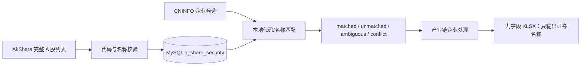

# A 股证券参考表与本地复用设计规格

日期：2026-09-08
范围：CNINFO 产业链采集器的证券代码标准化与本地匹配
状态：首期设计

## 1. 业务结果

建立一份持久化的当前 A 股证券参考表。AkShare 只在初始化或人工刷新参考表时抓取一次完整证券列表；产业链采集发现新企业时只查询本地 MySQL，不在每个节点或每家企业上重复访问 AkShare。

标准代码使用六位股票代码加交易所后缀：

| 证券 | 原始代码 | 标准完整代码 | AkShare 代码 |
| --- | --- | --- | --- |
| 贵州茅台 | `600519` | `600519.SH` | `sh600519` |
| 平安银行 | `000001` | `000001.SZ` | `sz000001` |
| 北交所示例 | `920047` | `920047.BJ` | `bj920047` |

产业链九字段 Excel 的业务列不变，仍只输出来源中的证券名称；公司字段仅过滤 `*` 标记并保留 `ST`，标准代码和 AkShare 代码保存在参考表中，供后续匹配和其他业务复用。

## 2. 当前基线与约束

- MySQL 已有 `company` 表，其中 `stock_code` 保存 CNINFO 接口返回的原始股票代码，当前可能只有六位数字。
- 现有九字段 XLSX 没有股票代码列，不能因为增加参考表而改变九字段交付格式。
- AkShare 的实时 A 股列表返回类似 `sh600519`、`sz000001`、`bj920047` 的代码值；代码前缀可直接确定交易所。
- 证券名称是产业链匹配的业务输入。来源名称主体按原文保存，只过滤公司字段中的 `*` 标记，不删除 `ST`，也不通过 LLM 或模糊规则擅自改名。
- 代码字段中的 `*` 等标记需要清洗；证券名称中的 `ST` 前缀必须保留。

## 3. 目标与非目标

### 3.1 目标

1. 初始化并持久化当前 A 股证券参考数据，覆盖沪、深、北交所。
2. 为每条证券记录同时保存六位代码、标准完整代码和 AkShare 代码。
3. 提供幂等的初始化/刷新入口，刷新失败时不破坏上一次可用参考表。
4. 让产业链企业匹配只依赖本地 MySQL 参考表，不在采集流程中调用 AkShare。
5. 对唯一匹配、未匹配和歧义匹配给出可观察的结果，不猜测代码或名称。
6. 提供一次性旧数据清洗脚本，把当前 `company.stock_code` 中可安全清理的代码值统一为六位数字，并过滤 `company_short_name` 中的 `*`。

### 3.2 非目标

- 不在每次 `crawl` 或每个节点任务中请求 AkShare。
- 不保存历史退市证券、逐次快照或接口响应审计链；首期只维护当前可用参考表。
- 不把股票代码加入现有九字段 XLSX。
- 不用名称模糊匹配、拼音匹配或 LLM 推断证券身份。
- 不删除证券名称中的 `ST` 或其他名称内容；只过滤公司字段中的 `*` 标记。
- 不建设独立证券行情、估值或交易数据系统。

## 4. 方案选择

### 4.1 方案：MySQL 参考表（推荐）

AkShare 初始化一次，把标准化后的证券映射写入 MySQL；后续采集通过本地查询复用。

- 首次可用证据：完成一次 AkShare 列表抓取和校验后即可查询。
- 运行结果：产业链任务不依赖 AkShare 临时可用性。
- 成本：新增一张表和一个初始化/刷新入口，改动最小。
- 风险：参考表可能随市场新上市证券变化，需要人工刷新。
- 升级路径：以后需要历史快照时再增加快照表，不影响当前匹配接口。

## 5. 数据模型

新增表 `a_share_security`。它是证券参考数据，不是产业链企业表；不与 `company` 建外键，避免把同一证券的参考身份和 CNINFO 企业实体强耦合。

```sql
CREATE TABLE `a_share_security` (
  `full_code` VARCHAR(16) NOT NULL COMMENT '标准完整代码，如600519.SH、000001.SZ、920047.BJ',
  `stock_code` CHAR(6) NOT NULL COMMENT '去除标记后的六位股票代码，如600519',
  `exchange` CHAR(2) NOT NULL COMMENT '交易所标识：SH、SZ 或 BJ',
  `security_name` VARCHAR(255) NOT NULL COMMENT 'AkShare 返回的证券名称，按来源原文保存',
  `akshare_symbol` VARCHAR(16) NOT NULL COMMENT 'AkShare 使用的代码，如sh600519、sz000001、bj920047',
  `updated_at` DATETIME(6) NOT NULL COMMENT '该参考记录最近一次写入时间（UTC）',
  PRIMARY KEY (`full_code`),
  UNIQUE KEY `uk_a_share_akshare_symbol` (`akshare_symbol`),
  KEY `idx_a_share_stock_code` (`stock_code`),
  KEY `idx_a_share_security_name` (`security_name`)
) ENGINE=InnoDB DEFAULT CHARSET=utf8mb4 COLLATE=utf8mb4_0900_ai_ci
  COMMENT='当前 A 股证券参考表：保存名称、标准完整代码和 AkShare 代码映射';
```

字段约束：

- `full_code` 是稳定主键。同一数字代码在不同交易所时，靠后缀区分。
- `stock_code` 只允许六位数字；不保存 `*`、空格或交易所前缀。
- `exchange` 只接受 `SH`、`SZ`、`BJ`，由 AkShare 代码前缀转换得到，不按代码首位猜测市场。
- `security_name` 不设唯一约束，名称重复或同名证券必须保留并在匹配时判定歧义。
- `akshare_symbol` 统一为小写交易所前缀加六位数字。
- 不增加来源 URL、原始 JSON、请求批次等证据字段；这张表只承担稳定映射职责。

### 5.1 与现有 `company` 表的边界

`company.stock_code` 继续保存 CNINFO 原始代码，避免破坏现有接口字段和企业去重逻辑。需要标准完整代码时，使用 `company.stock_code` 或企业名称查询 `a_share_security`：

```text
CNINFO 原始代码 / 证券名称
        │
        ▼
a_share_security
        │
        ├── full_code       600519.SH
        └── akshare_symbol  sh600519
```

首期不把 `full_code` 强行写回 `company.stock_code`，也不在 `company` 再复制一组证券字段。若未来明确要求企业主表直接提供标准代码，再单独增加迁移，不改变参考表契约。

## 6. 代码标准化规则

### 6.1 AkShare 行转换

对 AkShare 返回的 `代码` 和 `名称` 做严格转换：

1. 代码去首尾空白并转小写。
2. 代码必须匹配 `^(sh|sz|bj)[0-9]{6}$`；不符合的行进入错误报告，不写入正式表。
3. 取前缀映射交易所：`sh -> SH`、`sz -> SZ`、`bj -> BJ`。
4. 取后六位作为 `stock_code`。
5. 生成 `full_code = stock_code + "." + exchange`。
6. `security_name` 保留来源文本的首尾清理结果，不删除 `ST`、`*ST` 或公司后缀。

### 6.2 CNINFO 代码匹配

1. 对 CNINFO 代码字段只清理代码值中的 `*`、空白和交易所分隔符，再提取六位数字；不对证券名称执行相同清洗。
2. 用六位数字查询 `a_share_security.stock_code`。
3. 若只有一条记录，得到唯一 `full_code`。
4. 若有多条记录，用证券名称做精确匹配；仍不能唯一确定时返回 `ambiguous`，不猜测交易所。
5. 没有代码时，用证券名称精确查询；唯一命中才返回 `matched`，多条命中返回 `ambiguous`。
6. 代码和名称分别命中不同证券时返回 `conflict`，保留原始值并要求人工处理。
7. 没有命中时返回 `unmatched`，不触发 AkShare 请求。

匹配结果至少包含 `matched`、`unmatched`、`ambiguous`、`conflict` 四种状态，供日志和后续人工处理使用。

## 7. 初始化与刷新

### 7.1 初始化

初始化入口执行以下顺序：

1. 连接 MySQL 并执行迁移，创建 `a_share_security`（若不存在）。
2. 调用一次 AkShare A 股列表接口。
3. 在内存中完成代码格式校验、去重和完整性检查。
4. 输出预览：总行数、沪/深/北数量、无效行数、重复完整代码和前若干示例。
5. 只有校验通过后才写入 MySQL。

### 7.2 刷新

刷新是显式人工操作，不由 `crawl` 自动触发。先把完整 AkShare 响应转换并校验成功，再在一个事务中删除并写入参考表；任何下载、转换或写入异常都回滚，保留上一份可用数据。

刷新完成后打印：

- 写入总数和各交易所数量；
- 新增、名称变化、代码变化和删除候选数量；
- 无效或歧义记录示例；
- 参考表更新时间。

当前产业链采集只读取参考表，不执行刷新。参考表为空时，映射检查应给出明确提示；不能偷偷联网补抓。

### 7.3 现有数据库一次性清洗

新增 `scripts/clean_stock_codes.py`，处理当前 MySQL `company.stock_code` 和 `company_short_name` 字段，不修改 `company_name` 或其他企业字段。代码字段继续保存 CNINFO 原始代码的清洗结果，不在此脚本中补交易所后缀；`.SH/.SZ/.BJ` 完整代码由 `a_share_security.full_code` 提供。简称字段只去掉 `*`，保留 `ST`。

清洗规则：

1. 去除代码值首尾空白和 `*` 标记。
2. 去除明确的交易所分隔符或前缀后，只有恰好六位数字时才更新。
3. `NULL`、空字符串、无法得到唯一六位数字的值保持原样，列入异常清单。
4. 简称字段只去掉 `*`，不会删除 `ST` 或其他名称内容。

脚本必须分为两个显式阶段：

- 默认预览：`python scripts/clean_stock_codes.py --preview`，只读数据库，输出总行数、代码修改数、简称修改数、无需修改数、异常行数和若干原值/新值示例。
- 执行清洗：`python scripts/clean_stock_codes.py --execute`，执行前再次输出同样的预览摘要，要求人工明确确认后才在一个 MySQL 事务中更新；未确认、进程中断或更新失败均不得提交部分结果。

执行完成后打印实际更新数和异常值清单。清洗脚本不自动访问 AkShare；清洗完成后由操作人员执行现有 `--export-now`，重新生成九字段 XLSX。

## 8. 运行时数据流



产业链运行期间禁止调用 AkShare。映射失败只影响该企业的标准代码结果，不影响节点其他企业和节点任务提交；原始 CNINFO 名称仍保留。

## 9. 接口与实现边界

实现至少提供两个独立入口，名称可按现有 CLI 风格落地：

- `reference init`：表为空时建立完整参考表；已有数据时要求明确确认或提示使用刷新。
- `reference refresh`：重新抓取、预览、校验并原子替换参考表。

产业链 `crawl`、`resume` 和 `--export-now` 不隐式调用上述入口。`doctor` 只检查参考表是否存在、是否有数据和结构是否正确，不替用户联网刷新。

AkShare 依赖只服务于 `reference init/refresh`：适配器应延迟导入，参考表已经存在时，普通 `crawl` 不因未安装或暂时不可用的 AkShare 而失败。初始化或刷新时若依赖缺失，应在预览阶段给出安装提示并保持旧表不变。

## 10. 错误处理与恢复

| 情况 | 处理 |
| --- | --- |
| AkShare 请求失败 | 不改 MySQL 参考表，返回可重试错误 |
| 返回缺少代码或名称列 | 整批拒绝写入，保留旧表 |
| 代码格式非法 | 统计并展示示例；存在非法行时拒绝整批写入 |
| 标准完整代码重复 | 拒绝整批写入，提示源数据异常 |
| 本地名称多条命中 | 标记 `ambiguous`，不猜测 |
| 代码与名称冲突 | 标记 `conflict`，不覆盖原始 CNINFO 数据 |
| 参考表为空 | 映射检查失败并提示先执行初始化；不在采集时自动联网 |
| 刷新过程中进程退出 | 事务回滚，旧参考表保持可读 |
| 清洗脚本预览模式 | 只读，不执行任何 UPDATE |
| 清洗值不是唯一六位数字 | 保留原值并列入异常清单，不猜测 |
| 清洗执行中断或数据库错误 | 事务回滚，不留下部分更新 |

## 11. 验收场景

### ACC-1：完整表初始化

输入：AkShare 返回包含沪、深、北交易所代码的完整列表。
预期：每行写入 `a_share_security`，代码可同时得到六位代码、`.SH/.SZ/.BJ` 完整代码和 AkShare 代码。
检查：`SELECT COUNT(*)` 大于零，三类交易所数量可统计，主键和 AkShare 代码无重复。

### ACC-2：标准代码转换

输入：`sh600519`、`sz000001`、`bj920047`。
预期：分别生成 `600519.SH`、`000001.SZ`、`920047.BJ`。
检查：转换单元测试和数据库记录一致。

### ACC-3：本地复用

输入：产业链候选企业 `贵州茅台` / `600519`。
预期：只查询 MySQL，返回 `600519.SH` 和 `sh600519`。
检查：运行匹配测试时 AkShare 客户端调用次数为零。

### ACC-4：未匹配不联网

输入：参考表中不存在的新企业。
预期：返回 `unmatched`，保留 CNINFO 原始名称，不发起 AkShare 请求，不阻塞节点提交。
检查：日志有未匹配记录，节点任务仍可提交。

### ACC-5：名称歧义和冲突

输入：同名多证券，或代码命中证券 A、名称命中证券 B。
预期：分别返回 `ambiguous`、`conflict`，不自动选择。
检查：原始候选数据未被覆盖。

### ACC-6：刷新失败可恢复

输入：AkShare 返回非法代码或刷新中途发生数据库错误。
预期：新批次不落库，上一份参考表仍可查询。
检查：刷新前后有效行数和示例记录保持一致。

### ACC-7：交付格式不变

输入：完成参考表初始化并运行现有导出。
预期：XLSX 仍为九个业务列，证券名称按来源输出，不新增股票代码列。
检查：表头数量为 9，导出查询没有把参考表字段混入公司列。

### ACC-8：旧数据一次性清洗

输入：`company.stock_code` 中包含星号、空白、交易所标记和非法值，或 `company_short_name` 中包含 `*ST` 的现有数据。
预期：预览模式不产生数据库写入；执行模式只更新能安全得到六位数字的代码，并只过滤简称中的 `*`，保留 `ST`；非法代码保留并列出，企业全称不变。
检查：执行前后分别统计变更数，事务提交后数据库没有残留可清洗的合法代码标记；执行 `--export-now` 后 XLSX 仍为九个字段。

## 12. 最小实现任务

1. 新增 `a_share_security` migration 和 MySQL 存取方法，所有字段带中文注释。
2. 新增 AkShare 列表转换器、格式校验和预览输出。
3. 新增初始化/刷新入口，保证整批校验后事务写入。
4. 新增本地代码/名称匹配器和四种结果状态。
5. 在 `doctor` 中检查参考表，在 `crawl` 中禁止隐式 AkShare 调用。
6. 新增 `scripts/clean_stock_codes.py`，支持预览、显式执行、事务回滚和异常清单。
7. 增加离线单元测试和一个 MySQL 集成验证，不改变现有九字段导出契约；清洗完成后验证 `--export-now`。

## 13. 设计自检

- 真正的业务结果是“后续产业链任务可直接复用稳定证券映射”，不是每次重新抓行情数据。
- 必要阶段只有一次抓取、校验入库、本地匹配；没有加入历史快照、模糊匹配或在线兜底等额外环节。
- 参考表负责证券身份映射，`company` 负责 CNINFO 企业实体，导出器负责九字段交付，三者职责清晰。
- 失败时可以区分输入数据错误、匹配歧义、数据库写入错误和未匹配企业，不靠猜测掩盖问题。
